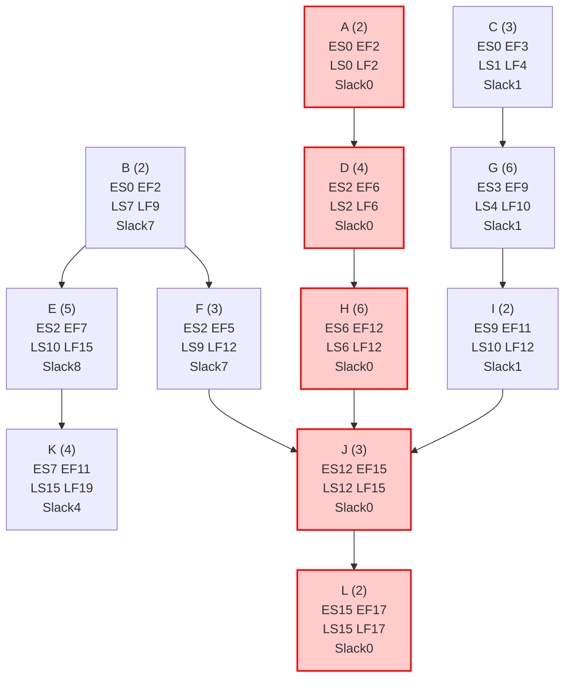

# PDM Network Diagram

```mermaid
flowchart TD
    classDef critical fill:#ffcccc,stroke:#ff0000,stroke-width:2px;

    A["A (2)<br>ES0 EF2<br>LS0 LF2<br>Slack0"]:::critical
    B["B (2)<br>ES0 EF2<br>LS7 LF9<br>Slack7"]
    C["C (3)<br>ES0 EF3<br>LS1 LF4<br>Slack1"]
    D["D (4)<br>ES2 EF6<br>LS2 LF6<br>Slack0"]:::critical
    E["E (5)<br>ES2 EF7<br>LS10 LF15<br>Slack8"]
    F["F (3)<br>ES2 EF5<br>LS9 LF12<br>Slack7"]
    G["G (6)<br>ES3 EF9<br>LS4 LF10<br>Slack1"]
    H["H (6)<br>ES6 EF12<br>LS6 LF12<br>Slack0"]:::critical
    I["I (2)<br>ES9 EF11<br>LS10 LF12<br>Slack1"]
    J["J (3)<br>ES12 EF15<br>LS12 LF15<br>Slack0"]:::critical
    K["K (4)<br>ES7 EF11<br>LS15 LF19<br>Slack4"]
    L["L (2)<br>ES15 EF17<br>LS15 LF17<br>Slack0"]:::critical

    A --> D
    B --> E
    B --> F
    C --> G
    D --> H
    E --> K
    F --> J
    G --> I
    H --> J
    I --> J
    J --> L
```

_Generated by scripts/generate_diagrams.py_
